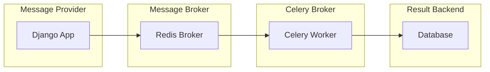

# How Django App and Celery works

```mermaid
flowchart LR

    subgraph Message Provider
    Django["Django App"]
    end

    subgraph Message Broker
    Redis["Redis Broker"]
    end

    subgraph Celery Broker
    Celery["Celery Worker"]
    end

    subgraph Result Backend
    DB["Database"]
    end

    Django["Django App"]-->Redis["Redis Broker"]-->Celery["Celery Worker"]-->DB["Database"]
```

