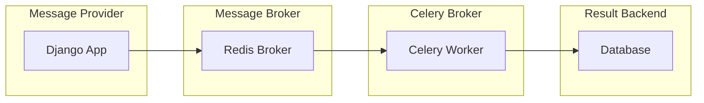

# How Django App and Celery works
How a Django + Celery dockerized should work

## Message Provider / Task Producer (Django App)
Identify the task that needs to be send and run by the Celery server. Triggered by user actions, form submissions, or others actions.

## Message Broker / Task Queue (Redis Broker)
The message broker is responsible for receiving the task from the message provider and sending it to the Celery worker. It is a queue that holds the tasks until the Celery worker is ready to process it.

## Celery Worker / Task Consumer (Celery Worker)
The Celery worker is responsible for receiving the task from the message broker and processing it. It is the one that executes the task and sends the result to the result backend.

