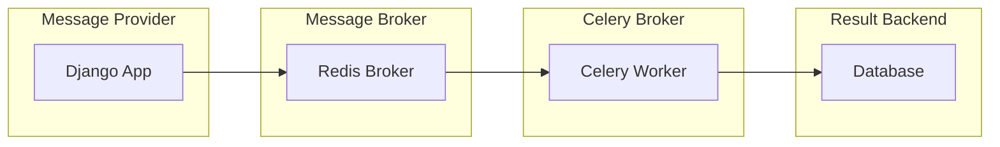

# How Django App and Celery works
How a Django + Celery dockerized should work

## Message Provider / Task Producer
Identify the task that needs to be send and run by the Celery server. Triggered by user actions, form submissions, or others actions.

